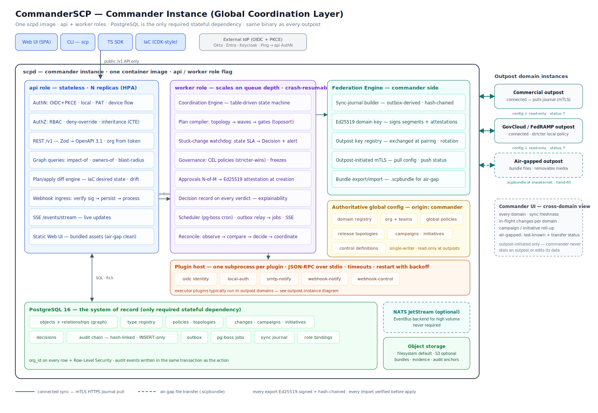
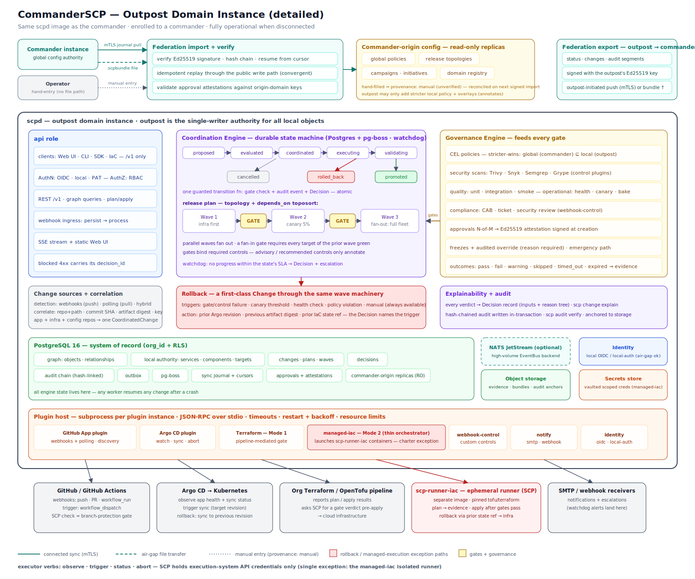
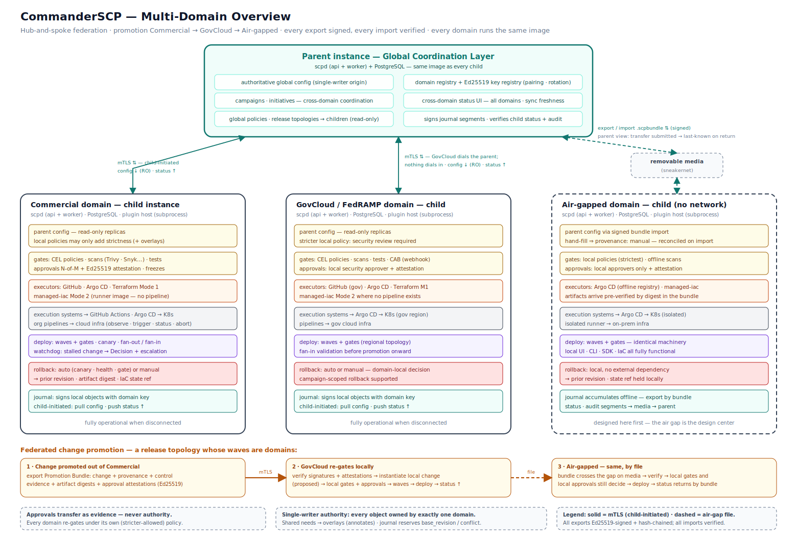

# CommanderSCP — Architecture Diagrams

| | |
|---|---|
| **Version** | 1.0 |
| **Status** | **Approved** — owner sign-off 2026-07-08 |
| **Derives from** | [PROJECT_CHARTER.md](../PROJECT_CHARTER.md) and [DESIGN.md](DESIGN.md) — where a diagram and DESIGN.md disagree, DESIGN.md governs. |

Three views of the same system. Every instance — commander or outpost — runs the identical `scpd` image plus PostgreSQL; the differences are configuration (role, enrollment) and which objects the instance is the single-writer authority for. (A third role, **retrans**, sits at a CDS boundary and is not separately diagrammed here — it validates and relays only; see DESIGN.md §13 and [ADR-0004](adr/0004-service-naming-commander-outpost-retrans.md).)

## 1. Commander instance (detailed)

The commander is the Global Coordination Layer (DESIGN.md §13). What this view shows:

- **api / worker split** — one image, two roles: the stateless API tier (AuthN/AuthZ, REST `/v1`, graph queries, plan/apply, webhook ingress, SSE) and the crash-resumable worker tier (Coordination Engine, Governance Engine, watchdog, scheduler, reconciliation loops).
- **Federation Engine, commander side** — builds the outbox-derived, hash-chained sync journal; signs segments and approval attestations with the commander's Ed25519 domain key; serves the journal endpoint outposts pull over mTLS; exports/imports `.scpbundle` files for air-gapped outposts.
- **Authoritative global config** — domain registry, org structure, global policies, release topologies, campaigns/initiatives, control definitions. The commander is the single-writer origin; every outpost holds these as read-only replicas.
- **PostgreSQL as everything** — graph, outbox, pg-boss jobs, Decisions, hash-chained audit, sync journal, role bindings; NATS is the optional high-volume event backend; object storage holds bundles, evidence, and audit anchors.
- **Cross-domain view** — outposts report status upward; the commander UI shows every domain, its sync freshness, in-flight changes, and campaign roll-up. The commander never edits outpost-owned data.

## 2. Outpost domain instance (detailed)

An outpost (Commercial, GovCloud, air-gapped, …) is where changes actually get coordinated against execution systems (DESIGN.md §9–§13). What this view shows:

- **Federation inbound** — commander config arrives by mTLS journal pull, `.scpbundle` file, or operator hand-entry (`provenance: manual`, reconciled on the next signed import). Every import verifies Ed25519 signatures, the hash chain, and approval attestations before applying.
- **Change lifecycle** — proposed → evaluated → coordinated → executing → validating → promoted, with cancelled and rolled_back branches; every transition passes through one guarded function that atomically checks gates, writes the audit event, and writes the Decision.
- **Waves and gates** — the plan compiler turns a release topology plus `depends_on` toposort into waves; gates bind required controls at wave boundaries; fan-out/fan-in and canary are wave patterns, not special code.
- **Governance feeding the gates** — CEL policies (global ⊆ stricter local), security scans (Trivy/Snyk/Semgrep/Grype), quality and operational controls, CAB/ticket via webhook-control, N-of-M approvals with Ed25519 attestations, freezes with audited overrides.
- **Rollback** — a first-class Change through the same wave machinery, triggered automatically (gate/control failure, canary threshold, health check, policy violation) or manually, returning to the prior revision / artifact digest / IaC state ref.
- **Plugin host and integrations** — every plugin in its own subprocess; GitHub App (webhooks + polling + discovery), Argo CD, Terraform Mode 1 (pipeline-mediated), and the managed-iac Mode 2 orchestrator, which launches ephemeral containers from the separate `scp-runner-iac` image (the charter's Managed Execution Exception — highlighted in red).
- **Federation outbound** — local status, changes, and audit segments signed with the outpost's key and returned to the commander by mTLS or bundle file.

## 3. Multi-domain overview

The hub-and-spoke reference topology (DESIGN.md §13). What this view shows:

- **Commander at the hub** — global config flows down as read-only replicas; status and audit flow up; the air-gapped spoke exchanges the same signed artifacts as files over removable media.
- **Three outposts, one machinery** — connected Commercial, stricter GovCloud/FedRAMP, and a fully disconnected air-gapped domain all run the same image with the same engines; only policy strictness and transport differ. Every domain is fully operational when disconnected.
- **Federated promotion** — Commercial → GovCloud → Air-gapped is a release topology whose waves are domains. A Promotion Bundle carries the change, provenance, control evidence, artifact digests, and per-approval Ed25519 attestations; each importing domain verifies signatures and attestations, instantiates its own local change, and re-gates under its own policies. **Approvals transfer as evidence, never authority.**

## Conventions used in all three diagrams

- **Solid teal lines** — connected sync (mTLS HTTPS journal pull). **Dashed teal** — air-gap file transfer (`.scpbundle`). **Dotted gray** — manual entry.
- **Red** — rollback paths and the managed-execution exception. **Yellow** — gates and governance. **Green** — data stores. **Orange** — plugin host. **Teal** — federation and signing.
- Every export is Ed25519-signed and hash-chained; every import is verified before apply.

Diagrams are hand-maintained SVG in [diagrams/](diagrams/); update them alongside any DESIGN.md change that alters what they depict.
